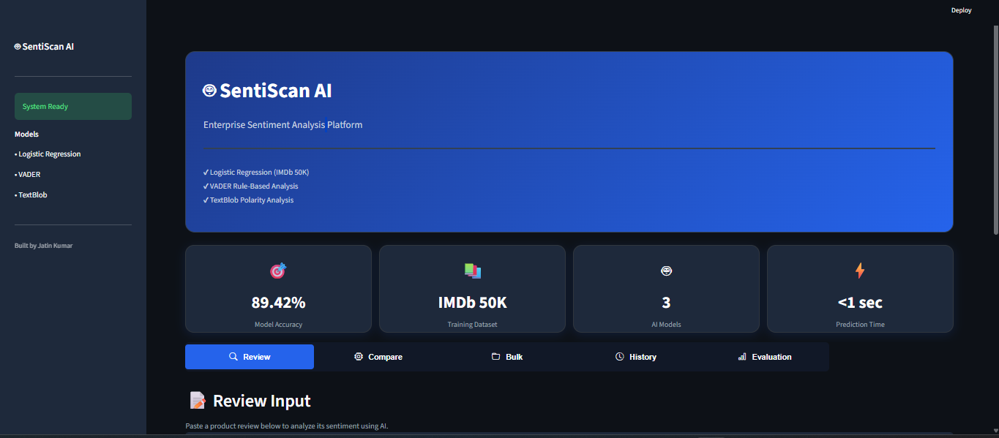
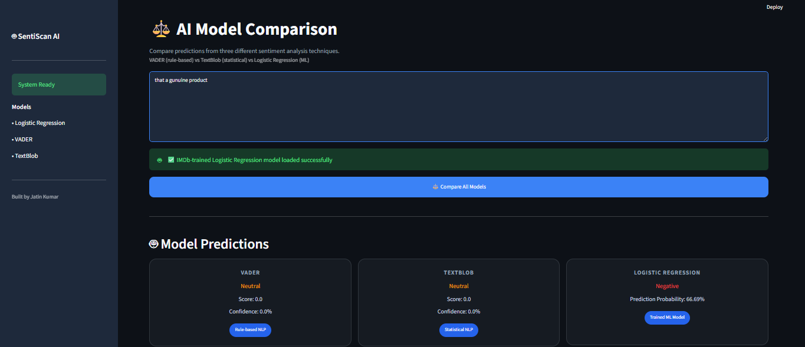
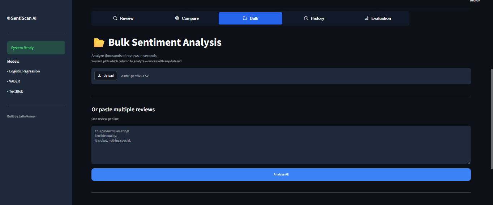
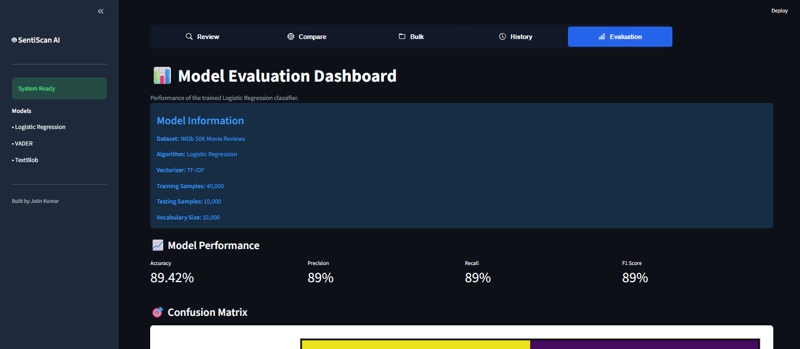

<div align="center">

# 🤖 SentiScan AI
### Intelligent Sentiment Analysis Dashboard using NLP & Machine Learning

Analyze customer reviews using **VADER**, **TextBlob**, and a **Logistic Regression model trained on the IMDb 50K dataset**.

</div>

---

# 📖 Overview

SentiScan AI is an interactive sentiment analysis dashboard built with **Python**, **Streamlit**, and **Machine Learning**.

The application compares three sentiment analysis techniques:

- 🤖 Logistic Regression (Trained on IMDb 50K)
- 💬 VADER
- 🧠 TextBlob

Users can analyze individual reviews, compare predictions across models, perform bulk sentiment analysis on CSV files, and evaluate model performance through an interactive dashboard.

---

# ✨ Features

## 📝 Single Review Analysis

- Real-time sentiment prediction
- Confidence score
- Sentiment breakdown
- Important keyword extraction
- Word cloud visualization

---

## 🤖 AI Model Comparison

Compare predictions from

- VADER
- TextBlob
- Logistic Regression

Includes

- Confidence comparison
- Agreement detection
- Explainable AI
- Important learned words

---

## 📂 Bulk Review Analysis

- Upload CSV files
- Automatic text column selection
- Analyze thousands of reviews
- Download processed CSV
- Sentiment distribution chart

---

## 📊 Model Evaluation Dashboard

Displays

- Accuracy
- Precision
- Recall
- F1 Score
- Confusion Matrix
- Dataset information

---

## 🕒 Prediction History

- Stores previous predictions
- Session summary
- History visualization

---

# 🧠 Machine Learning Pipeline

IMDb 50K Reviews

↓

Text Cleaning

↓

TF-IDF Vectorization

↓

Logistic Regression

↓

Sentiment Prediction

---

# 🛠 Tech Stack

### Programming

- Python

### Machine Learning

- Scikit-learn
- Logistic Regression
- TF-IDF

### NLP

- VADER
- TextBlob

### Visualization

- Matplotlib
- WordCloud

### Frontend

- Streamlit

---

# 📈 Model Performance

| Metric | Score |
|--------|------:|
| Accuracy | **89.42%** |
| Precision | **89%** |
| Recall | **89%** |
| F1 Score | **89%** |

Dataset

- IMDb 50,000 Movie Reviews

---

# 📷 Screenshots

## Home



---


---

## Single Review


---

## Model Comparison



---

## Bulk Analysis



---

## Model Evaluation



---

# 🚀 Installation

```bash
git clone https://github.com/Jatin0977e/SentiScan-AI.git

cd SentiScan-AI

pip install -r requirements.txt

streamlit run app.py
```

---

# 📂 Project Structure

```text
SentiScan-AI
│
├── app.py
├── analyzer.py
├── evaluation.py
├── train_model.py
├── model.pkl
├── vectorizer.pkl
├── requirements.txt
├── README.md
├── assets/
└── data/
```

---

# 🎯 Future Improvements

- Deep Learning (LSTM/BERT)
- Aspect-Based Sentiment Analysis
- Multi-language Support
- REST API
- Docker Deployment
- Cloud Database

---

# 👨‍💻 Developer

**Jatin Kumar**

B.Tech CSE (AI & ML)

Passionate about Artificial Intelligence, Machine Learning, and NLP.

---

# ⭐ If you found this project useful

Please consider giving it a ⭐ on GitHub.
